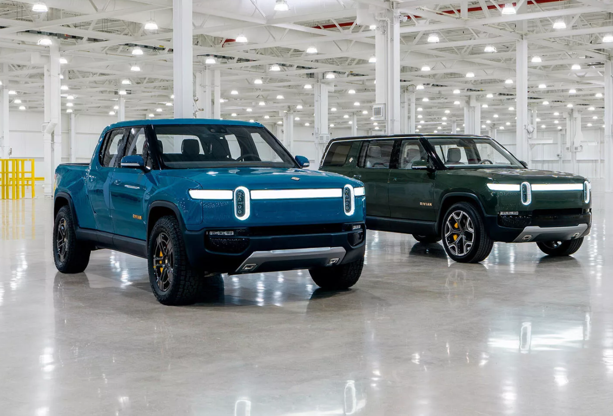

# cs105-prj-phase3-lovecars

# Overview
As we know cars are important to people based on their futures such that; Brand, Model, size, power, gas mileage, PRICE, and ...
I found this can be interesting because of my interest in cars, so I decided to find a data set of car future and their prices. Most of the dealership selling their cars lower than the actual MSRP, which I will look into it in this project. We will also look at the popularity and number of sales, regarding brands or cars’ future.
We also look at the type of cars (FWD, AWD, 4X4,...), will compare them by brands. we also look at car types and price, brand to different zip codes. I limited zip code in my data(which in each part of the country I choose one zip code only).
Please Note: if someone more interested in specific zip code, or more data, can go back to phase one, and run my code with different zip codes, and different amount of pages.  

# Goals
In the introduction, we described the overall idea of this project, but let’s look more specifically at the purpose of this project. I chose this topic as my final project just not because I love cars and it’s my interest. I chose because it’s one of the most important needs of humans these days. I always had questions about MSRP, and how these numbers coming from, and how, and why dealership selling their cars under these prices. What makes one car special to others, and how one can sell more in this market. Why one brand is more popular to others. How new cars with hybrid engines, or electric cars effects these prices, and popularity. We will look into most of these questions, and analyzing them in this project. One more interesting part that I found out when I was at my friend dealership and heard they are seeling more truck and SUV in their dealership just because of the living, or the area they have the dealership. I found this might be interesting, and I will look into it in my project as well as other futures. 

# Objective
To accomplish this project, we need to collect useful and accurate data. Some of these data already exist as CSV file that we can go ahead and use them, but for other types of data that we need, we need to go to obtain them by web crawling using selenium. I decided to not include the visualization of the existing VSV file, rather go collect my data by web crawling do all requirements.
I'm using cars.com for crawling data and parsed those data into different columns which would help me and make my job much easier during data cleaning. I decided to spend more time during data crawling and make my life easier in the future. 

Here is the link that I modified it to what I need :
https://www.cars.com/for-sale/searchresults.action/?dealerType=localOnly&page=1&perPage=20&rd=99999&searchSource=GN_BREADCRUMB&sort=relevance&zc=92521 

# How to run the code!
To run the code for web crwaling, you need to install selenium : pip install -U selenium 
You also need to install and download right version of google driver : https://sites.google.com/a/chromium.org/chromedriver/downloads
More information how to install all drivers for selenuim can find here : https://selenium-python.readthedocs.io/installation.html

# What have done on this project

This project contains 3 phases, each phase will help us for future purposes, here what I have accomplished in theses 3 phases :

# Phase 1 

In phase one I wrote a python code with selenium library to crawl the data from cars.com during this process I pictured many technical issues. Fo instance: some of the topics (car future) were are empty or some of them didn’t even have any classes that I can collect the data. I fixed this problem by collecting the family classes and parsed them into smaller columns.
phase one handled the collecting data and parsed them into CSV files for phase 2.

# Phase 2

In phase 2, I ran my data and visualized most of the columns to see the correlation between each future in my dataset. I found all outliers in the dataset, and drop them from data set, just because they are not important in my dataset if some data was important and NULL, I had the option to replace them by its neighbor, or another method. In my dataset, I just needed to drop the, after visualization and found the correlation, and data cleaning I saved my new dataset into a new CSV file for phase 3.

# Phase 3

In phase 3 I performed data analysis. AS I described it earlier, here I did my prediction and found the answer to most of my questions by built a model to predict this future, using linear regression. I used the model also to find how the features are correlated to the target variable. 

In data analysis, we are working and building our data and visualized them for phase 3 to do our data analysis, and prediction and see the correlation, so exactly what I did in this project.

 
